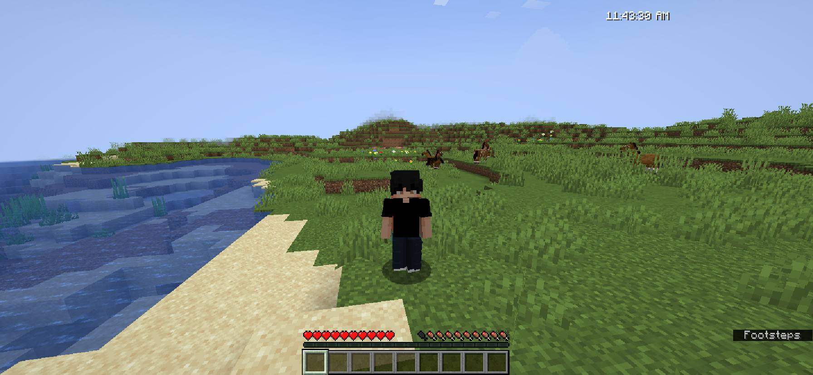
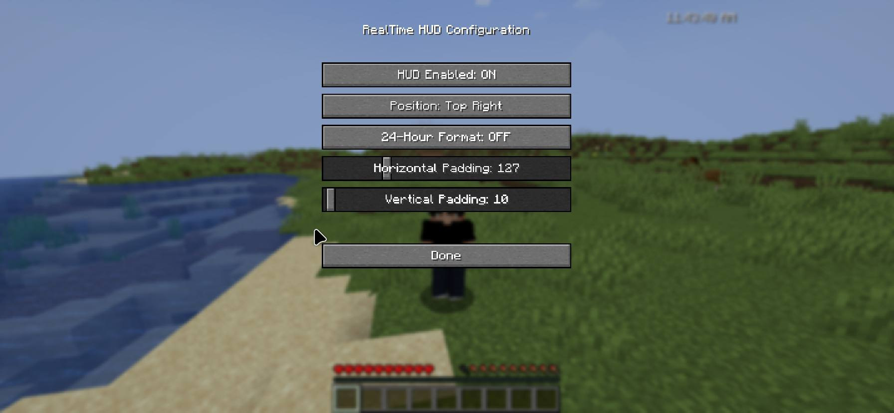

# RealTime HUD

A simple and customizable Minecraft Fabric mod that displays your real-world system time on your HUD.

[](https://www.minecraft.net/)
[](https://fabricmc.net/)
[](LICENSE)
[](https://github.com/drevenant7/RealTime_HUD/releases)

## ✨ Features

- 🕐 **Real-time clock display** - Shows your actual system time on the HUD
- 📍 **Four position presets** - Top Left, Top Right, Bottom Left, Bottom Right
- 🎨 **Adjustable padding** - Customize horizontal and vertical spacing (0-500 pixels)
- ⏰ **Dual time formats** - Toggle between 24-hour (23:45:30) and 12-hour (11:45:30 PM)
- ⌨️ **Convenient keybindings** - Quick access with R and F keys
- ⚙️ **Mod Menu integration** - Easy in-game configuration
- 💾 **Persistent settings** - Your preferences save between sessions
- 🚀 **Lightweight** - No performance impact

## 📸 Screenshots






## 📋 Requirements

- **Minecraft** 1.21.x
- **Fabric Loader** 0.16.0 or higher
- **Fabric API** (required)
- **Mod Menu** (optional, but recommended for GUI configuration)

## 📥 Installation

1. Install [Fabric Loader](https://fabricmc.net/use/installer/)
2. Download [Fabric API](https://modrinth.com/mod/fabric-api)
3. Download the latest release of RealTime HUD from [Releases](https://github.com/drevenant7/RealTime_HUD/releases) or [Modrinth](https://modrinth.com/mod/YOUR_MOD_SLUG)
4. Place both JAR files in your `.minecraft/mods` folder
5. Launch the game and enjoy!

## ⌨️ Keybindings

| Key | Action |
|-----|--------|
| **R** | Toggle HUD on/off |
| **F** | Switch between 24-hour and 12-hour format |

You can also change these keybindings in Minecraft's controls settings.

## ⚙️ Configuration

### Using Mod Menu (Recommended)

1. Install [Mod Menu](https://modrinth.com/mod/modmenu)
2. Open the game and click **Mods** from the main menu
3. Find **RealTime HUD** and click the config button
4. Adjust settings:
    - **Enable/Disable** - Turn the HUD on or off
    - **Position** - Choose corner placement
    - **24-Hour Format** - Toggle time format
    - **Horizontal Padding** - Adjust X offset (0-500)
    - **Vertical Padding** - Adjust Y offset (0-500)

### Manual Configuration

Config file location: `.minecraft/config/realtimehud.json`
```json
{
  "enabled": true,
  "position": "TOP_LEFT",
  "paddingX": 10,
  "paddingY": 10,
  "use24HourFormat": true
}
```

**Position options:** `TOP_LEFT`, `TOP_RIGHT`, `BOTTOM_LEFT`, `BOTTOM_RIGHT`

## 🔧 Building from Source
```bash
# Clone the repository
git clone https://github.com/drevenant7/RealTime_HUD.git
cd RealTime_HUD

# Build the mod
./gradlew build

# The JAR file will be in build/libs/
```

## 🐛 Bug Reports & Feature Requests

Found a bug or have a feature request? Please [open an issue](https://github.com/drevenant7/RealTime_HUD/issues) on GitHub!

## 📝 License

This project is licensed under the MIT License - see the [LICENSE](LICENSE) file for details.

## 🙏 Acknowledgments

- Built with [Fabric](https://fabricmc.net/)
- Config GUI powered by [Mod Menu](https://modrinth.com/mod/modmenu)

## 📊 Stats


---

**Enjoy the mod? Give it a ⭐ on GitHub and download on [Modrinth](https://modrinth.com/mod/realtimehud)!**
